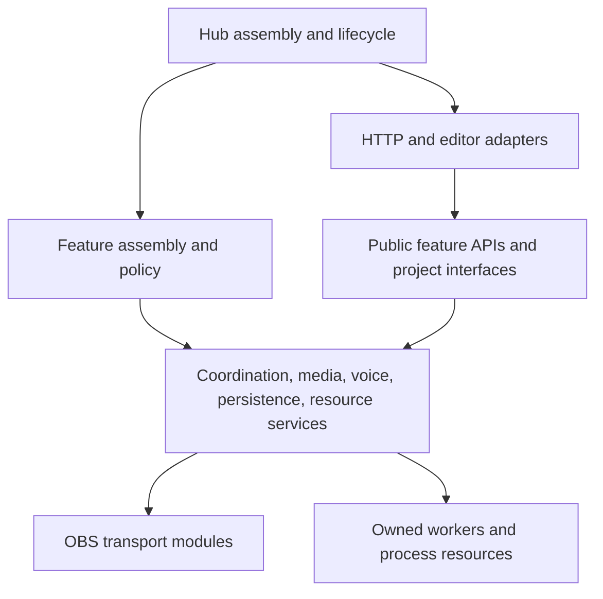

# Streaming Hub responsibilities

The supported entry point is `Run Hub.bat` / `hub.py` in this checkout. Feature
packages own their policy and personal data. Shared infrastructure owns common
resources, admission, and coordination. Compatibility facades retain old imports
while implementation lives with its actual owner.

## Dependency direction

Shared services do not import feature implementations. Feature peers communicate
through project interfaces, events, or shared provider contracts. HTTP feature
adapters are explicitly declared composition boundaries in the architecture
checker; they may import only the feature they expose.

`lib/browser_effects/presentations.py` publishes explicitly named feature artwork
during that feature's Hub lifetime. Identity tokens guard unregister; the shared
HTTP server serves original file bytes (including JSON manifests) and serializes
state API objects separately; it never imports feature renderers. `PlayCoordinator.request(...,
pause=names)` admits feature-owned pause policy under the actual ticket,
alongside saved rules, preserving newer intent precedence and completion ownership.

## Shared owners

| Responsibility | Owner | Contract and boundary |
| --- | --- | --- |
| Hub assembly and shutdown | `hub.py`, `main.py`, `lib/hub_runtime/` | Project startup/readiness, OBS-dependency partitioning via feature `REQUIRES_OBS` metadata, and joins live in `projects.py`; editor lifetime in `editor.py`; services bind to the Hub stop signal |
| Discovery and instance ownership | `lib/project_registry.py`, `lib/single_instance.py` | Select supported projects and prevent duplicate Hubs |
| Project controls/status | `lib/project_runtime.py`, `hub_actions.py` | Interfaces expose status, capabilities, and feature actions; shared manual pause/resume routes through the coordinator |
| Workflow discovery and review | `lib/workflow_map/source.py`, `catalog.py`, `validation.py`; owner-local `workflows.json` / `*.workflows.json` | Parse source without imports; feature owners describe their behavior; AST proofs flag changed explanations; proofs accept supported checkout module junctions only at their exact LOCALAPPDATA/StreamingHub/feature-packages home and reject nested escapes; current settings/rules refresh without rewriting personal data |
| Workflow observation and history | `events.observe`, `lib/workflow_map/journal.py`, `hub_ui/workflow_map.py` | Hub UI lifetime owns one bounded local SQLite writer; existing status poller samples public contracts even without a browser; observers enqueue promptly and cannot dispatch business actions; history excludes message/voice bodies and credentials |
| Published living-world ownership | `lib/workflow_map/source.py` | Static delivery does not transfer presentation ownership: `hub_ui/app/lobby-motion/` is a compiled mirror of scene_voice_switcher policy, while its `shared/` subtree mirrors public browser_effects mechanics. Both remain in their canonical owners' review scopes; the ordinary Hub scene-switcher page remains Hub-owned |
| Program-scene ownership | `lib/coordination/scenes.py` | Sole program-scene writer; serializes preparation/switching, revisions, manual choices, temporary leases, and latest deferred automatic intent; manual revision guards delayed workflows across owned temporary returns |
| Scene handoff and observation | `lib/coordination/scene_session.py`, `scene_events.py` | Reserve before loading, scoped pauses, ownership-checked return; optional session transition is applied by SceneDirector for entry/return while preserving destination overrides and the global selector; one Hub event subscription detects outside switches and reconnects |
| Lobby presentation contract | `lib/coordination/lobbies.py`, `lobby_layout.py` | Feature-owned inventory publishes complete candidate and layer-data snapshots. Accepted scene transactions repair named layers before selecting a location; direct Hub and native OBS entries consume the same data. Publication and repair share a presentation lock. The mechanical adapter snapshots before repairs, preserves personal source settings/filters and unowned overlays, and performs no program-scene writes. It creates missing links to existing camera/screen resources; it never starts another capture worker |
| Desktop visibility | `lib/display_capture.py` | Show/hide writes only the actual input inside Hub Display Capture; Test keeps its gameplay input; standalone `tools/install_lobby_scenes.py` owns reversible collection migration and preserves transforms/filters |
| Cross-project playback admission | `lib/coordination/playback.py`, `pauses.py`, `serial_actions.py`, `rules.py` | Latest pending exclusive intent per project, request-specific completion, reference-counted pause claims, manual claims, and layered permission gates; callbacks schedule promptly |
| Cross-feature policy contracts | `lib/coordination/game_policy.py`, `lib/twitch_clip_session.py` | League publishes scene policy; Twitch publishes clip-session availability; callers never read another feature's private state |
| Voice and keyboard | `voice/service.py`, `voice/listener.py`, `voice/ptt.py`, `voice/transcription.py`, `lib/global_hotkeys.py` | Optional upload word timing consumes the same model under its exclusive lease; one microphone/model lifetime and one keyboard child; feature adapters receive commands/keys |
| Physical media source ownership | `lib/shared_media/playback_worker.py`, `playback_controller.py` | One worker per source through cleanup; cancellation and one replaceable pending source request; layered sources remain separate |
| OBS asset presentation | `lib/shared_media/asset_playback.py`, `source_playback.py`, `source_audio.py`, `asset_layout.py`, `source_setup.py` | Source setup, load confirmation, audio application, layout selection, and asset capture/parking are separate components |
| Generic media assembly and controls | `lib/shared_media/media_project.py`, `interface.py`, `commands.py`, `runtime_settings.py` | Wire reusable components and trigger policy; no copied source controller in each generic feature |
| Profiles and inventory | `lib/shared_media/runtime_profiles.py`, `inventory.py`, `lib/snapshots.py` | Complete mapping generations for readers; profile activation/reload serialized; no clear/update window |
| Trigger windows and random selection | `lib/shared_media/trigger_window.py`, `random_mode.py`, `random_playlist.py` | Trigger winner/deadline, random-loop lifetime, and category/no-repeat selection are separate; random waits for admission and cleanup completion |
| Decoder startup | `lib/shared_media/media_startup.py` | Shared startup admission and real playback progress checks |
| Asset preparation and metadata | `lib/asset_preparation.py`, `lib/media_metadata.py` | One paced preparation worker and bounded shared metadata cache; one admitted probe, with cached reads independent of unrelated misses |
| Finite media conversions | `lib/media_jobs.py` | Weighted CPU budget, user-before-preview queue order, bounded FFmpeg threads, cancellation and child reaping |
| Persistence | `lib/json_store.py`, `lib/project_settings.py`, `lib/shared_media/profile_store.py` | Atomic unique temporary writes and shared in-process read/modify/write transactions; malformed personal files are preserved |
| Media review intent | `lib/media_review.py` | Read-only portable producer catalog `{clips: {id: {path, purpose}}}`; explicit replay-only files are excluded from automatic review, with legacy metadata and personal decisions preserved. Capture policy and classification writes remain in Instant Replay; Footage Desk composes the reader in `review_pool.py`. |
| Personalization and faders | `lib/settings_backups.py`, `lib/asset_fader.py`, `lib/shared_media/single_source_state.py`, `layout_rules.py`, `controls.py` | External history, loaded-asset level ownership, filters/transforms, per-asset placement precedence, latest project/profile/category/file offsets |
| OBS transport | `obs/client.py`, `sources.py`, `animations.py`, `media.py`, `audio.py`, `outputs.py`, `scenes.py` | Connection, inventory/transforms, animation, media transport, audio, outputs, and scene queries are separate; `interaction.py` is a compatibility facade. The connection adapts SDK and raw current-program reads to the null-guarded scene-list query, preserving response fields and reporting missing program state as unavailable |
| HTTP transport | `hub_ui/server.py`, `hub_ui/routes/` | Dispatch, status/settings/audio/control routes and feature adapters; the Hub-owned HTTP server has a 64-slot accept queue for ES-module/asset bursts while its accept loop is busy. Song/replay APIs retain private runtime state in their features |
| Hub browser workspace | `hub_ui/app/js/app.js`, `nav.js`, `catalog.js`, `search.js`, `pages/` | Shell routing and searchable presentation catalog; Live desk observes status/coordination (including actual OBS stream status) and offers game/production workspace focus without changing policy. `desk-playback.js` presents scoped active transports and pause-owner explanations; `desk-audio.js` operates only named physical microphone/desktop sources through the existing OBS audio API, preserving focus and rejecting polls that predate a fader edit. `desk-view.js` owns the desk structure and display language; `desk-picker.js` owns focused operating dialogs (`desk-controls.js` is a compatibility export) for scene, clip, song, sound and playlist catalogs plus saved workflows, calling public feature controls. Library owns discovery, `audio-workspace.js` assembles the existing source/media level owners, and `action-feedback.js` owns pending/error feedback. Workflow map presentation lives in `workflow/atlas.js` (nested areas and evidence aggregation), `workflow/map.js` (SVG interaction), `workflow/behavior.js` (resource focus and owner-authored illustrative state outcomes), and `pages/workflows.js` (read-only page lifecycle); grouped activity can connect independent observers without implying an event delivery. Views release subscriptions and polls on unmount and reject stale async results; they do not own scenes, playback or personal settings. |
| File-response resources | `lib/http_files.py` | Existing HTTP owners authorize paths and supply policy headers; this stateless helper serves byte ranges in bounded chunks and releases handles on disconnect. Editor assets, replay previews, browser-effect audio and Twitch media share it. |
| Browser presentation | `lib/browser_effects/` | Server runtime, channels/sessions, OBS adapter and audio preparation remain separate; `web/production.js` is a thin optical-material compatibility facade, `art/sound-scenes.js` assembles the authored/character/reaction cue owners, approved legacy/racing owners, and extended-library tech/play/mood owners. `cue-accents.js` and `library-accents.js` own individually arranged supporting casts; `cue-ink.js` owns local paint mechanics. These compile into self-contained `web/rave.js`; `borders.js` owns the perimeter canvas. Twitch reads only the public optical mechanics through its static adapter; event composition remains in its feature package |
| Hooray confetti art | `lib/browser_effects/art/hooray.js` | Own bounded foil trajectories, streamers, poppers and perimeter ribbons; compiled into `web/rave.js` and selected by Soundboard's mapping through `web/renderers.js`. Draws sparse full-canvas confetti with native alpha using the existing audio clock, readiness and cleanup; original media and per-asset settings stay preserved |
| Border rendering mechanics | `lib/browser_effects/web/subtle.js` | Own the public mask, one-time sprite atlas decoding, safe edge placement, immutable edge-mask caching, material shading, atmospheric fields and fading light mechanics; subject geometry, palettes and composition stay in each presentation owner |
| Mom Frog presentation and preparation | `lib/browser_effects/art/mom-frog.js`; `tools/prepare_mom_frog.py` | The sound-cue owner composes three photographic views and pond-concert props using the existing audio clock and edge mask. The standalone maintenance tool owns finite denoising, external original-media backup and a recipe; it preserves the video, asset identity and saved gain. No runtime filter policy or new playback worker is added. |
| Random soundboard character borders | `lib/browser_effects/art/spam-cues.js`; `spam-ink.js`; `spam-{lizard,gary,quack,bonk,piuw}.js` | The dispatcher selects the five existing effects without owning hotkey selection or audio. Each performance owner composes its native three-pose raster cast and themed props; shared local paint helpers reuse the existing atlas decoder, audio clock and edge mask. `tools/review_spam_cues.cjs` owns finite isolated real-audio, transparency, motion and media-preservation QA. |
| Piuw/Frog audio and flowing borders | `art/piuw-border.js`, `art/frog-border.js` under `lib/browser_effects`; `tools/prepare_border_audio.py` | Visual owners add clock-driven plasma trails and flowing water/splash/croak waves without workers or timers. The standalone maintenance tool owns only the explicitly requested two-asset denoising policy, content-addressed external original/previous backups, candidate validation and atomic installation while idle; it preserves gain, asset identity and copied Frog video. Recipes allow reprocessing the original rather than repeatedly filtering a cleaned asset. |
| Short-cue timing and previews | `web/playback.js`, `web/borders.js`, `web/subtle.js` under `lib/browser_effects`; `tools/review_spam_cues.cjs`, `sound_preview_player.js/.css`, `test_sound_preview_timing.cjs` | Playback awaits artwork and a cleared warm-up frame before starting audio; current audio time and ended remain the only active clock/cutoff. BorderShow opts into 12-ms attack/18-ms release for cues under 1.5 seconds, leaving other presentations' fades unchanged. Finite exports distribute at least 60 frames/second across the exact original duration. Review controls stay outside the picture, share one encoded A/V clock, allow only one audible loop, freeze together on pause and clear one-shots on ended. Decoded-frame QA verifies visible onset, complete motion and millisecond A/V timestamp alignment. |
| Celebration border art | `mini projects/twitch_celebrations/art/` | `celebration-scenes.js` assembles native supporter/gift, raid and cheer performances into `raid_art.js`; local ink/prop helpers own only materials/silhouettes. The existing show owners supply elapsed time, text, custom media and cleanup. The four approved follower images belong to `spirit_assets/`, served by celebrations' HTTP allowlist, independently of transition-art cleanup. |
| Twitch rewards | `lib/twitch_redemptions/` | Service lifetime, transport, reward management, storage and playback engine stay separate |
| Twitch companion clips | `lib/twitch_clips.py`, `lib/twitch_clip_session.py` | Replay capture requests clips for every admitted manual save; shared transport serializes creation/confirmation using Celebrations' published authorization and stop signal |
| Twitch VOD/rewind startup check | `lib/twitch_stream_settings/` | Hub-owned bounded startup check; local Chrome extension enables exact dashboard switches and verifies persistence in the user's existing login; nonce-scoped status/retry API; no API credential or browser-cookie access |
| Resource diagnostics | `lib/performance_monitor.py`, `lib/process_metrics.py` | Existing shared polling and paced media-load sampling; process counters attribute Python/media CPU without inspecting command lines; no feature-owned duplicate monitor |

## Feature responsibilities

Twitch chat commands live in `mini projects/twitch_commands/`: `settings.py` owns
personal command data, lossless atomic edits and optimistic revisions; `policy.py`
owns matching, permissions and response generation; `service.py` owns bounded
deduplication, alias-shared cooldowns and revision-guarded reply admission. `main.py`
registers one subscriber and releases it on shutdown. Replies reuse the Hub-owned
`lib/twitch_chat.reply` queue and existing Twitch authorization; the feature never
opens another chat socket or stores credentials. `api.py` exposes settings and
private previews, `hub_ui/routes/twitch_commands.py` is its declared HTTP
composition owner, and `pages/twitch-commands.js` presents the editable catalog.

Channel presentation artwork is a standalone artifact owner in `stream_brand/`.
`catalog.js` owns authored copy, `design.html`/`.css`/`.js` own graphic layout,
and `tools/build_channel_brand.cjs` owns finite browser exports and visual checks.
`stream_brand/panels_v2/` owns the distinct image-led About card artwork and copy;
`tools/build_channel_panels.cjs` exports only that versioned panel family and
checks decoded artwork, text bounds and upload sizes. It cannot overwrite the
installed OBS cards or earlier panel assets and adds no live runtime.
`tools/install_channel_brand_obs.py` is the standalone maintenance owner for
additive native image scenes. It uses shared OBS transport, snapshots settings,
preserves existing source settings and placement on reruns, and never selects the
program scene. It is not imported by the Hub and adds no runtime service.
`stream_brand/trailer/timeline.py` validates authored cuts against actual media;
`soundtrack.py` owns its original synthesized score; `render.py` is a finite
standalone exporter over the shared media-job budget. It preserves original
footage and personal review metadata, renders on C: independently of replay
storage configuration, and verifies every delivery through a complete decode.

`stream_brand/intro/` owns the separate forty-second cinematic stream intro.
`timeline.py` owns beat-aligned v1 cuts and delivery validation; `story_timeline.py`
owns v2 combat choreography, pose groups and asset-specific visual metadata;
`continuity_timeline.py` owns the v3 opening spirit transformations and continuous
shield recovery, ram knockdown and grounded-villain phoenix sequence;
`cinema.py` owns
the offline art, alpha-layer, approximate depth, typography and atmosphere renderer;
`audio.py` owns source-excerpt analysis and original procedural effects; `render.py`
owns one finite renderer/encoder lifetime through the shared media-job budget,
source fingerprints and full-decode delivery validation. Generated art and media
stay on C: because F: is full. This package has no Hub startup registration,
OBS writes, settings changes, listeners or publishing behavior.

`stream_brand/sketch_journey/` owns the separate inexpensive concept animatics.
`choreography.py` owns its beat-aligned journey and continuous character poses;
`paint.py` owns original stick figures, animal outlines and sketched landmarks;
`escape_choreography.py` owns the sanctuary awakening, persistent obstacle states
and continuous escape poses; `escape_paint.py` owns the sanctuary drawings,
body-worn spirit envelopes, masonry impacts and celestial destination reveal;
`cinematic_timeline.py` owns the v3 shot sequence, world positions and camera
intent; `sketch_space.py` owns local perspective projection and near-plane clipping;
`cinematic_paint.py` owns circular-room pencil geometry, branching spirit lights,
subjective spirit anatomy, rescue close-ups, phoenix storm and seated vista;
`illustrated_timeline.py` owns the v4 single-entrance escape, return to the same
island and interior camera positions; `illustrated_materials.py` owns filled
facets and the local depth buffer; `illustrated_paint.py` owns the continuously
animated colour concept, body-worn spirit forms and full entrance cave-in;
`motion_timeline.py` owns the v5 anticipation, build, contact and recovery clocks
and camera continuity; `motion_rig.py` owns fixed-length world and POV limbs and
planted gait; `motion_effects.py` owns progressive energy travel, claw strikes
and contact-driven debris; `motion_paint.py` owns the textured rig-based concept;
`motion_audio.py` owns finite original contact-effect synthesis and the
artifact mix, preserving the music-only export and unchanged source audio;
`art_timeline.py` owns the cinematic-art opening camera, center-born light and
immediate claw-triggered collapse; `art_assets.py` explicitly loads unchanged
generated PNGs; `art_materials.py` supplies perspective-correct UV and alpha
samples through the existing local depth-buffer contract; `art_effects.py` owns
outward surface illumination and collapse accents; `art_paint.py` composes the
painted world, connected character rig, gateway and articulated spirit cards.
The art pass is a standalone finite artifact and adds no Hub runtime resources.
`motion_review.py` owns reusable finite movie decoding, frame extraction, rig
and audio audits; `art_review.py` owns the art pass's targeted review frames,
asset-preservation evidence and versioned delivery archives.
`render.py` owns the finite lightweight export and full decoding checks through
the existing media-job budget. It references lobby artwork without modifying it.

The authored Spirit Afterparty lobby lives at `hub_ui/app/spirit-lobby/` and uses
existing Hub HTTP transport. This project directory is a junction to
`C:/StreamingMedia/SpiritLobby/2026-10-03/web` because the media drive filled up.
Static transport authorizes that artifact's resolved root separately; all other
static paths retain their original containment boundary. `room.js` loads the
cleaned original clubhouse; `props.js` owns the booth, speakers and display
assembly. `surfaces.js` owns panel geometry/perspective, and `text-screens.js`
caches flat typography before projection. `penguin.js` owns the 3.8-second paired
emote sequence, alternating wave slots, pose blends, periodic recoloring and one
whole-character opacity pass; `sprite-paths.js` decodes unchanged classic frames.
`fractal-galaxy.js` owns an unbounded nested-system journey with at most eight
cached textures. `projection.js` assembles built-in programs. `screen-content.js`
owns one cancellable catalog refresh, at most four media slots, silent looping
video, pause/hide behavior and complete document cleanup. `scene.js` owns one
frame-capped animation loop. The foreground keeps the booth in front of the
existing camera. `screen-studio.js` owns media-import and display-authoring UI;
`studio.js` encodes optional overrides as paired URLs.

`celebration.js` owns a bounded collection of independent finite accents and
queued alternating waves. Particle, prop and botanical drawing live in the
`party-*` artist modules; they own no workers or external resources.
`party-studio.js` owns the action controls. `action-link.js` owns one visible
document's existing Hub SSE subscription and up to eight cancellable requests;
hide and teardown close them. `spirit_lobby/actions.py` validates the canonical
action catalog and creates stateless cue envelopes. The HTTP adapter publishes
those cues through `hub_ui.updates.broadcast`; it adds no event bus, playback
worker or OBS controller. Each browser admits cues independently, deduplicates
the local preview/server echo, rejects stale delivery, expires finished accents
and rejects excess new work without cancelling accepted animations.
`party-director.js` owns autonomous choreography in that same document frame
loop. Deterministic wall-clock phrases let both OBS layers join the same ongoing
party despite different paint costs. Weighted novelty, small companion entrances
and soft visual pressure vary pace and overlap, with manual cues reducing new
automatic activity. The director scales cadence with motion speed, caches at most
four phrases and 256 attempt identities, and adds no timers, services, SSE cues
or persistence. Defaults enable a lively party; paired URLs carry the chosen
gentle/lively/wild/manual-only rhythm. The new floater, guest and spark artist
modules keep their finite drawing responsibilities separate from scheduling.

The public `spirit_lobby/library.py` feature owns display selections, text, format
validation, bounded imports, preserved originals, C: media storage, external
history and atomic complete catalog publication. Its constructor/imports have no
side effects or workers. `hub_ui/routes/spirit_lobby.py` only adapts HTTP to that
public owner and reuses shared file-range transport. It adds no server, hooks,
decoder workers, audio or program-scene writes. Workflow discovery explicitly
includes this owner. `tools/install_spirit_lobby_obs.py` remains the additive
maintenance owner for OBS scene assembly and preserves personalized reruns.
Browser/HTTP QA uses a disposable library; native QA checks camera, scene,
source/filter and fader preservation without selecting program.

Starting Soon owns waiting-room policy in `mini projects/starting_soon/service.py`,
personal configuration and named playlists in `settings.py`, atomic per-clip
levels in `levels.py`, dedicated OBS sources in `presentation.py`, and one source
worker in `player.py`. `queue_state.py` owns the editable live queue separately
from saved playlists; `layouts.py` owns validated placement and per-asset precedence;
  `artwork.py` owns the artwork catalog. `looks.py` validates reusable visual presets;
  browser `world-deck.js` owns two bounded image layers, reveal cancellation and drift,
  while the overlay owns separate artwork, message and frame presentation. The
  production desk saves visual looks without changing playlists, asset placements
  or levels, and disabling highlights cancels the existing clip worker.
  Its persistent temporary `SceneSession` prevents automatic game
routing from interrupting the waiting room and releases only its own pause claims.
`clip_library.py` consumes Instant Replay's public `clip_catalog()` and
`clip_selection(paths)` project-interface contract, preserving replay inventory,
titles, validation and existing asset levels in their owner. The HTTP composition
adapter `hub_ui/routes/starting_soon.py` exposes only this feature's public API.
The Hub browser page assembles separate playlist, library/private-preview and
appearance editors. Private previews reuse Instant Replay's public preview
transport. The OBS browser overlay owns visual crossfades, responsive canvas
scaling and recorded-footage labels, following the native source's placement.
`presentation.py` migrates the native item into a dedicated nested OBS stage,
carrying its full transform and retaining the original hidden item. This keeps
placement and visibility live when Studio Mode duplicates the parent scene.
Message visibility and scenery captions are personal settings owned by the
feature. Its public show/hide-message actions support future control schemes.
The overlay exposes full, artwork-only and transparent message-only render modes;
the Hub appearance editor provides reusable URLs and original text-free PNG links.

| Feature | Internal responsibilities |
| --- | --- |
| Desktop chat overlay | `lib/chat_overlay/settings.py` owns independent transactional personal preferences; `catalog.py` owns provider parsing and bounded catalog requests; `desktop.py` owns configuration/activation of the installed transparent host; `pointer.py` reads native cursor/window state without hooks or workers; `startup.py` owns one optional, bounded launch attempt after the Hub HTTP ready signal and joins on shutdown; `sticker_pack.py` owns finite authored vocabulary additions; `chaos_pack.py` owns selection, transactional persistence and public catalog composition for the local animated library in `chat_sticker_pack.json`; `tools/build_chat_chaos_pack.py` is its finite maintenance installer from captured public metadata. `hub_ui/routes/chat.py` exposes these public contracts. Browser `overlay.js` applies saved typography/message density and bounds the message list; `protocol.js` parses Twitch tags, `stickers.js` owns phrase matching, `readability.js` owns content-only hover/desktop clarity, and `sticker_studio.js` presents the searchable, paged library with viewport-limited thumbnail animation, offscreen/hidden cleanup and local hover previews. Hover never changes cards, geometry, focus or click-through. |
| Spirit transitions | `lib/scene_transitions/web/rig.js` and `mesh.js` own continuous painted-surface mechanics and explicit atlas overrides; per-animal `rigs/` modules own gritty anatomy, deterministic acting and projected contacts. `rigs/bear/art.js` selects quadruped paint and bounds its view buffers; `bear/calibration.js` owns landmarks and fixed bones; `bear/motion.js` owns gait/support and paw paths; `bear/skin.js` owns joint-based paint/wrist orientation; `bear/turn.js` registers yaw views; `bear/front-motion.js` owns complete frontal view weights, lens-pressure projection and claw coordinates; `bear/front-paint.js` owns intact frontal paint and bounded blend buffers. `bear/presentation.js` composes depth and complete view blends. `web/bear/approach.js` owns shared world placement, `web/bear/tears.js` owns persistent per-strike cover geometry, and `web/bear.js` owns foreground performer staging; the renderer provides an optional foreground composition hook after masked coverage. Bear public facades stay thin. Turtle art/calibration/motion/skin/presentation live in `rigs/turtle/`, owning one intact painting, source-registered body/four-limb regions, bounded paint generation, diagonal planted crawl and exact source-root binding; turtle/joints.js owns the two-bone knee solve, skin.js follows upper/lower segments and rigid claw pads with a connected shoulder socket; `web/turtle/projectiles.js` owns the three rocks and destruction, `shield.js` owns defense timing and solid coverage, `dome.js` owns rough jade-stone facets, irregular rim and bounded jade/gold current optics, and `turtle_sound.py` owns its finite soundtrack. Turtle public facades and choreography assembly stay thin. Ram skin selection/crops/material belong to rigs/ram/skin-pack.json; ram/art.js owns complete bounded painted generations; calibration.js owns thirteen-view UV anatomy; views.js owns named pose contracts; leaps.js owns parabolic bounds and complete crouch/push/tuck/reach phases; turn.js owns planted true-back yaw and the frontal rear/fall sequence; motion.js assembles world trajectory, facing and continuous pitch. joints.js and skin.js own articulated tissue, rigid hooves and a bounded local head/neck registration field; registration.js preserves early native body proportions and late horn/ground registration; presentation.js owns far/body/near and whole-view composition. web/ram/stage.js, impact.js and reveal.js own staging, golden-stone coverage and plate release; ram_sound.py owns finite synchronized sound. Ram public facades stay thin. `rigs/phoenix/art.js` owns four camera views, two wing surfaces, isolated talon/tail paint and bounded generation buffers; `anatomy.js` owns measured ratios and UV mounts; `motion.js` owns yaw, feather lag and talon acting; `projection.js` owns the shared painted mount/contact geometry and fixed leg bones; `paint.js` owns depth layering and premultiplied view/surface blends. `web/phoenix/flight.js` owns world trajectories, `entrance.js` rebirth props/flight accents, `storm.js` material flow and ash optics, `veil.js` solid wing-origin coverage/erosion, and `palette.js` cold-fire/ember colors. `phoenix_sound.py` owns finite synchronized sound generation. Phoenix and flame compatibility facades stay thin. `characters.js` dispatches complete painted asset generations and releases replaced resources; `renderer.js` rejects stale loads. `web/performance.js` owns continuous trajectories; per-animal choreography owns contact-driven cover/reveal; catalog/timing own eight performances and safe cut metadata. Native OBS owns fixed media children, shuffled selection, alternating performances and playback-clock cuts. HTTP only serves preview assets. `installation.py` owns pure collection patch policy; finite export/install/QA adapters preserve unrelated data and never launch OBS for closed-OBS updates. |
| Soundboard | `main.py` wires profiles, commands and triggers and registers a runtime asset catalog/selection provider with bounded cleanup; `desk.py` owns manual selection policy, and `interface.py` exposes `asset_catalog()` / `play_asset(source)` to the generic HTTP project adapter. Desk selection uses the same admitted playback path and current per-asset settings as keys/voice, stopping its random mode first. `player.py` adapts its OBS/browser presentation to shared source workers and coordination gates |
| Specific Song | `commands.py` interprets controls/categories; `library.py` loads aliases/bindings; `matcher.py` ranks; `player.py` owns song presentation; `api.py` exposes library/commands; `main.py` assembles |
| Instant Replay | `capture.py` owns marks, serious/replay-only capture intent and save results; `inventory.py` owns one filesystem inventory for runtime and offline management, including tags and linked raw-copy suppression; `selection.py` owns candidate selection and one cancellable save continuation; `playback.py` owns presentation through final cleanup; `source_playback.py` prepares the hidden decoder, waits for a settled first frame and holds it through entry or clip reveal; `presentation.py` owns pure mode/copy/viewport policy; `stage_settings.py` owns personal presentation preferences; `stage.py` publishes complete stage/capture/progress snapshots, reconciles current labels after library edits and owns revision-scoped cover/reveal acknowledgments with bounded native fallback; `obs_stage.py` owns dedicated backdrop/motion/matte inputs and scene-item references to existing capture/camera sources; browser `replay-stage/clip-transition.js` renders finite viewport-only handoffs without controlling playback; `audio.py` restores desktop audio; `editing.py` owns saved cuts; `trimming.py` handles capture cuts; `library.py` owns atomic metadata, eligibility and archived aliases; `runtime_state.py` owns the feature handshake; `api.py` exposes controls; `main.py` wires lifecycle |
| League API | `service.py` owns runtime services; `client_scenes.py` chooses client-phase and configurable between-games policy once per transition, guards delayed intent and preserves newer scene choices; `scene_routing.py` prepares and requests presentation through the director; shared game policy exposes automatic-lobby/hold decisions |
| League events | Interpret game events and production presentation; Live Client traffic shares `lib/league_live_client.py`; production borders use public interface capabilities |
| League gameplay HUD | `league/core/match_lifecycle.py` gates gameplay on a positive live timer and latches cumulative GameEnd evidence across reconnects; `league/hud_presentation.py` alone owns nested map/HUD and alive-only Udyr visibility. Separate HUD scenes retain independent crops/masks over shared capture inputs; `tools/align_league_hud.py` is the finite, settings-snapshotted OBS calibration owner. |
| League border art | `production/web/scene.js` composes layers and applies saved strength once; `event-art.js` owns dispatch, caption and entrance envelopes. `art/event-scenes.js` assembles native elemental, Void, structure, combat, vital, progression, economy, lifecycle and inference performance owners, plus `soul-performance.js` for continuous death; `event-ink.js` owns local paint helpers and `event-props.js` reusable subject silhouettes. The build compiles these owners into self-contained `event-relics.js`; original raster files remain preserved outside the live bundle. Approved Hextech remains in `web/elements.js`. `match-screens.js` composes the original match picture and caption-free matching border against one server deadline; the browser assembly gives this presentation precedence over ordinary borders, clip slots and sprites. The existing static adapter serves public optical mechanics from `lib/browser_effects/web/subtle.js`. Renderers consume observed state and never infer game policy. |
| Twitch celebration art | `overlay.js` owns the browser clock and cleanup; `supporter_show.js` owns miniature spirits and dynamic subscriber copy/name fitting; `cheer_show.js` owns Bit worlds, runtime text and custom visuals; `raid_art.js` owns raid arrivals. Each uses existing event transport, queue and media controls. |
| League Stats | `normalize.py` interprets live/post-game evidence and reported roles; `timeline.py` interprets official checkpoints and purchase events; `collector.py` owns one bounded polling/history worker over existing League transports; `riot.py` owns credential refresh, verified public identity and read-only Riot transport/budgets; `enrichment.py` owns bounded resumable archive enrichment; `ranked.py` owns persisted observed ladder movement; `presentation.py` owns recap, recent form, live target pace, account labels and coverage; `audience.py` owns evidence for current-lane and lifetime viewer questions; `service.py` owns reconciliation and assembly; `observations.py` owns audited helper-counter policy; `management.py` owns saved sessions and reversible review policy; `community.py` owns bounded viewer stat requests; `chat_replies.py` owns concise Twitch copy and local previews; `store.py` owns the transactional external archive; `analytics.py` owns coverage-aware summaries and `insights.py` derives performance, records and trends; `api.py` is the public HTTP/project contract |
| Scene voice switcher | `commands.py` owns pure matching; `layouts.py` owns artwork, apertures and legacy aliases; `settings.py` owns lossless rotation/placement preferences; `presentation.py` publishes authored layer data and repairs through shared mechanics; each active chat viewport uses its board dimensions, with inactive browsers shut down. `inventory.py` discovers groups/nested scenes and the existing Spirit Afterparty, publishing complete layer plans, rotation and exclusions; `routing.py` owns director requests; `api.py` exposes gallery, configuration and repair controls; `main.py` owns one command/event/hold loop and catalog lifetime. Rejected/stale requests never prepare visibility; direct Hub/native OBS entries repair published layers without another scene writer. The gallery provides current-location feedback, search, per-world rotation/placement, and explicit entry with desktop visible; Live desk uses the same labeled catalog. Lobby browser mode reuses the chat transport/channel with full-opacity, persistent messages without changing desktop preferences. `passages.lua` owns the installed OBS-lifetime native item handoffs and one frontend subscription, released on unload, with no worker/socket/timer; it preserves personal transitions. `passage_installation.py` owns pure script-entry policy; `tools/install_lobby_passages.py` is the finite off-air collection adapter, while `verify_lobby_passages.py` owns finite native QA through SceneSession. Neither installer nor Lua writes program scenes |
| Sound effects / TikTok | Feature configuration and trigger policy over the generic media components |
| Living lobby artwork | `scene_voice_switcher/motion.py` and `web/reef-*.js`, `stage.js`, `studio.js` | Eleven authored worlds (Reef, Forge, Sanctuary, Sky Harbor, Storm Coast, Phoenix Observatory, Spirit Railway, Tavern, Future Lounge, Spirit Arcade and Aurora Camp) animate cached regions of their original paintings and admit finite thematic visitors with soft pressure and novelty weighting. worlds.js loads the chosen world; each world owns landmarks, atmosphere and guest performances. painted-world.js shares decoded-art assembly within this feature, and the studio replaces one iframe when the selected world changes. Feature policy supplies cast, landmarks, saved apertures and choreography. Public `lib/browser_effects/web/world-motion.js` supplies only bounded scheduling and cached triangle-mesh mechanics. The stage owns one visible-document loop and tears down instances and canvases; complete screen/camera/chat apertures are cleared after all accents. The optional published layer follows the original foreground, or the camera in flat paintings, and precedes dedicated chat; native OBS shuts it down while inactive. `tools/build_lobby_motion.py` owns finite provenance-preserving static publication; `install_lobby_motion.py` owns finite off-air installation and preservation checks. Original art, personal inputs, filters and placements survive. No new Hub worker, socket, keyboard hook or scene writer is introduced; the existing Spirit Afterparty retains its own automatic party renderer |
| Mood cues / Love Me | `love_me/catalog.py` and `score.py` own authored directions and editable file-time word cues; `montage_catalog.py` owns the cinematic still selection and provenance; `assets.py` publishes explicit mood-owned C: image/font files, installed by the finite maintenance owners `tools/install_signal_assets.py`, `tools/install_mood_montage.py` and `tools/install_mood_fonts.py`; `web/montage.js` owns full-frame cover layout, an independent saved file-time musical-hit entrance, a non-repeating file-clock cut sequence starting immediately on the hit, compensated crossfades and closing transparency; `web/signal.js` owns larger typeface cycling and held-word fading; `web/type-ink.js` owns bounded worn glyph rendering; `settings.py` owns lossless variations/audio imports; `service.py` serializes original stages and repeat sessions on one worker; `presentation.py` owns asset faders, routing and ID-scoped browser cleanup. `main.py` owns one keyboard subscription and a bounded intent queue. `api.py`/`interface.py` expose public controls; `hub_ui/routes/mood_cues.py` is the declared HTTP adapter and `pages/mood-cues.js` owns the private editor/preview. Original assets and `987` remain intact. |
| Twitch celebrations / Spotify | Feature-specific event and remote-service behavior; Spotify's `audio_texture.py` owns a bounded salient-partial roughness proxy from the existing FFT; `audio_analysis.py` owns fixed-gain waveform and unsaturated full-window presence, absolute-range spectral measurements, causal frequency-dependent apertures, fixed-gain Parseval energy per register, per-register stereo space and bounded batched FFT plans; `process_audio.py` owns Spotify-only packet capture and capture-clock metadata; `audio_worker.py` owns one isolated process, parent-death exit, newest-sample relay and bounded cleanup; `audio_runtime.py` assembles its MTA capture thread and existing HTTP socket so the audio-to-browser path stays in that process; `audio_channel.py` owns fixed complete-generation mailboxes for newest audio and Hub controls; `presentation_state.py` bridges Hub media/visibility policy and publishes the ready worker identity; `obs_presentation.py` owns browser attachment and a settings-preserving refresh once each HTTP/capture worker is ready, including replacements; `media_notifications.py` owns bounded WinRT event subscriptions and prompt media-loop wakeups; `service.py` owns session/state lifetime and bounded idle/media and latest-audio change notifications; `http_server.py` owns loopback state/static transport, persistent no-delay connections and bounded client cleanup; `web/reactive.js` owns conditioned signal features and optional legacy mesh simulation; `music_motion.js` owns absolute-register onset articulation, ordinary-fluctuation rejection thresholds, released frequency accents, stereo response and bounded bass spring/peaks and eight local spectral voices, separate smoothed structural presence, sustained texture phases and phrase envelopes; `music_pacing.js` owns a separate sustained body-size presence envelope, phrase-scale intensity, spectral activity, relative dynamics, held timbre tension/roundness, bounded swelling/release gestures and eased movement speed independently of fast articulation; `music_strings.js` owns the fixed 8-by-65 coupled-string state, amplitude pulls, wave propagation, neighbour coupling and damping; `music_space.js` owns a fixed 96-by-8 spectral memory, arrangement entropy, register focus and an audio-integrated, bounded yaw/pitch/roll orbit; `journey.js` owns scene selection, transition progress, musical travel, continuous structural evolution and palette phase and bounded band history; `stage_palette.js` owns pure color families and restrained phrase lift/release accents; `stage_geometry.js` owns shared contour mechanics, read-only sampling of the physical string field, scene-specific deformation budgets and abstract compositions; `stage_spirits.js` owns pure faerie/animal silhouettes and spectral articulation; `stage_morph.js` owns canonical curve sampling, bounded correspondence by contour role, spatial subdivision of repeated open curves, XYZ contraction of unmatched decorative contours, surface-density budgets and live geometric transport; `stage_depth.js` owns the pure eight-voice counterpoint paths, continuous scene correspondence and rigid XYZ view transforms, fixed focal length and frame scale throughout the foreground orbit, an inverse view basis and consistent spatial/material projection; `stage_renderer.js` owns the pure phrase/bass body-scale mapping, direct visible-canvas presentation, fixed GPU resources, transparent geometry depth ordering, analytic facet lighting, measured fine surface grain fixed in model space through perspective-correct interpolation and same-scene Canvas fallback; presentations read simulation state without advancing it; `music_feed.js` owns bounded track input calibration, generation rejection and capture-clock simulation advancement independently of paint cadence; `overlay.js` owns polling, visibility, viewport scaling, temporary WebGL surface recovery and frame lifetime, skipping off-scene painting while retaining musical history; common lifetimes and controls remain shared |
| Footage Desk | Separate supported application and lifecycle; preserve its process when restarting the Hub. `visual_analysis.py` owns offline visual observations; `visual_lobby.py` owns the cheap user-reference background matcher; `temporal.py` owns League boundary/replay policy; `audio_analysis.py` owns selected-track speech, game-overlapping chunk admission, explicit sparse checkpoint coverage and per-game normalization; `analysis.py` owns finite analysis batches and full-file verified duplicate reuse; `jobs.py` owns the single worker, foreground priority, cooperative yields and public job snapshots that retain active work; `analysis_store.py` publishes atomic generations; `analysis_cache.py` owns disposable resumable checkpoints and content fingerprints; `scoring.py` owns configurable ranking; `analysis_api.py` is the public review contract; `review_pool.py` composes the shared read-only capture-intent catalog for scan, library, CSV and analysis exclusion, preserving stored review decisions. `web/workflow.js` owns review/saved-clips/clear-space presentation and pending feedback through explicit `app.js` owner callbacks; it never writes the catalogue or deletes files directly. `web/workflow.css` owns the desk layout. Existing `store.py` owns personal review markers and `media.py` owns bounded decoder/encoder commands and verified optional exports with portable source metadata. |

## Ownership rules

`lib/twitch_chat.py` owns one Hub-started read-only IRC connection and publishes
`twitch.chat.message` with Twitch-provided login, channel, message ID and moderator
metadata. It rejects shared-chat identities from another room. `twitch_chat_replies.py`
owns one bounded Helix reply worker under the same Hub stop/join lifecycle;
`twitch_chat_session.py` publishes scoped authorization callbacks registered by
Twitch Celebrations, which remains the token/refresh owner. Replies reject stale
requests, replaced authorization, changed channels and stopped feature intent.
League Stats' `chat_replies.py` owns command copy and scoped local previews. Browser `league-stats-form.js` owns filtered chart/navigation presentation, `league-stats-overlay-builder.js` owns local presentation choices and copyable URLs, and overlay `model.js` owns view/rotation selection. Review drafts stay with the feature's browser controls; persisted revisions remain owned by `management.py`/`store.py`. League Stats subscribes only
during its runtime, queues commands with a fixed bound, and authorizes them in
its own feature policy. `hub_ui/routes/league_stats.py` is a declared public API
composition adapter and owns no game state. Stats are keyed by account/game ID,
reconciled in place, and stored outside Git under LOCALAPPDATA/StreamingHub.
Missing evidence remains unknown; manually observed Nexus hits never become
automatic confirmations. Unresolved roles never get guessed from champion names.

Footage Desk's `web/app.js` owns source selection, playback, proposed review ranges
and the timeline viewport. It publishes scoped `footage:timeline` snapshots and a
`reviewSourceRange` / `reviewSavedRange` contracts. `web/clip_editor.js` owns draft sizing,
local zoom, mode/slider presentation and inline note fields; `web/clip_drag.js` owns
fixed-scale edge dragging, bidirectional selection drawing and viewport panning;
pointer capture is released on completion, source/window replacement or page hiding. Browsing
and zooming preserve clip boundaries. Playback coalesces pending frame seeks until the decoder
finishes the previous seek, retaining the latest source-scoped target. `web/clip_history.js` owns one reversible
clip decision and rejects undo after a newer saved edit; explicit owner callbacks apply draft
changes, source-frame seeks and bounded preview requests. `app.js` rejects stale preview intent and
updates the selected saved marker through the existing store API.
`web/clip_editor.css` owns the focused review layout.
`web/recording_timeline.js` owns full-recording game/saved-range presentation,
consumes scoped timeline snapshots and rejects obsolete game responses from
`analysis_api.game_marks`. `web/timeline_review.css` owns the simple timeline layout.
`web/voice_markers.js` owns derived voice-spike cues,
reads `analysis_api.voice_marks`, rejects stale source-selection responses and
uses that review contract. `web/between_games.js` presents grouped approximate background cues through the same source navigation contract and `analysis_api.between_marks`. Analysis cues do not create or replace personal ranges.
`analysis_sampling.py` owns bounded game refinement and brief game-to-desktop
probe windows. It retains a separate window at the last chronological gameplay HUD,
excluding playback intervals, when an estimated end falls far into a lobby.
`analysis.py` selects the sampling budget and executes those probes on its existing
decoder and job. Quick estimates use a coarser local interval and omit subsecond
desktop probes; completed finer results with the same audio selection remain reusable.
`temporal.py` alone decides whether the resulting evidence confirms a game end.
`visual_outcomes.py` validates result-banner/client context and rejects browser
screenshots and history lists; chronology retains unresolved result conflicts.
Current client panels use local header/button geometry when queue labels are cropped;
browser chrome behind the native client does not erase that result evidence.
The same panel geometry can recover Victory or Defeat titles clipped by the lobby mask;
partial words without that client evidence remain unknown.
The fixed top OCR crop can supply a heading left of the detail crop, after mapping
it to the same coordinates and validating the current panel's controls. Animated
banner crops keep their separate origins and never supply that client geometry.
`analysis_migrations.py` owns visual checkpoint compatibility and required refresh
timestamps; interrupted upgrades retain source-scoped work without losing evidence
that falls outside a later sampling grid. Quick estimates also retain current
visual observations from finer interrupted sampling grids without repeating OCR.
`visual_playback.py` owns pixel evidence for full-screen browser player controls;
`temporal_playback.py` extends that evidence through the same recorded HUD run,
including hidden controls and pauses. These playback intervals are excluded by
the existing chronology/audio owners. Context-only checkpoint upgrades use the
analysis job's existing decoder and retain compatible OCR and speech work.
Chronology can revoke a soft portrait boundary when the same independent HUD
clock resumes during a death overlay. It retains the latest advancing clock,
rejects frozen ticks, and preserves confirmed result/Continue boundaries.
The same chronology owner requires separate consecutive loading readings before
closing a known game; single purple animation frames and subsecond repeats cannot
discard later gameplay or voice evidence. Strong Continue/results take precedence.

A playback ticket identifies a request, not just a project. Its completion
releases only its own pause claims. Replacements acquire their new claims before
releasing the old ones. Overlapping claims resume a project only after the final
claim releases. Preexisting/manual pauses survive unrelated playback completion.
Newer reciprocal playback requests can proceed while older requests wait, avoiding
mutual pause deadlock. Layered work observes a module permission gate.

Source workers retain the loaded asset identity through cleanup. A newer request
cannot reuse that physical source until cleanup ends. Generic, Soundboard, song,
replay and browser adapters use the shared resource services while retaining their
specific presentation requirements.

Temporary scene sessions reserve before media loading. Automatic requests can
wait while an owned session advances through multiple presentation scenes with
`SceneSession.present(scene)`. Each advance rejects revoked or inactive leases
and retains the original return target and pause claim. Automatic requests can
retain one latest deferred destination; deliberate choices invalidate older
leases. Scene revisions guard delayed callbacks. An external OBS switch revokes
a temporary lease, including an observed away-and-back switch. Losing the event
stream also revokes the lease because ownership can no longer be established;
orderly Hub shutdown preserves the lease long enough for scene return.
Delayed phase returns capture `manual_revision` before client I/O. That guard
survives owned temporary scene activation/return, but rejects a deliberate choice,
outside OBS switch or lost observation stream before changing lobby visibility.
An unchanged queue, idle phase or champion draft does not reclaim the scene.

JSON transaction locks coordinate writers inside the Hub process. Atomic writes
keep external readers from seeing partial files; external writers still require
their own coordination. Complete snapshots prevent map iteration from observing
a partially reloaded profile or asset index.

## Visibility and verification

`GET /api/coordination` reports the scene revision, temporary owner/reserved scene,
latest deferred destination and bounded recent decision history. It also reports
playback ready/cancelled/allowed gates and pause claims with owner names, kinds and
request sequences. Existing project status and resource diagnostics complement it.

`AGENTS.md` requires these boundaries for future coding agents. `CONTRIBUTING.md`
shows extension contracts and verification commands. `tools/check_architecture.py`
and `.github/workflows/architecture.yml` reject accidental boundary bypasses.
`tools/run_offline_tests.py` blocks OBS connections and treats uncaught worker
exceptions as failures. The guardrails support review; they do not replace
behavioral ownership/cancellation tests.

`tools/offline_test_resources.py` is the standalone maintenance owner for test
process CPU policy and OS-owned admission: one suite per checkout, bounded
default numerical threads and below-normal Windows priority. It never changes
the live Hub or Footage Desk process priority.

Personal settings and asset files remain in their existing locations. Recording
and replay storage remains `C:\StreamingMedia\Replays`; see `RECORDING-STORAGE.md`
before any path migration or settings restore.

See `CODE-CLEANUP-AUDIT.md` for earlier audit context and `RESOURCE-MANAGEMENT.md`
for resource measurements and workload verification.

