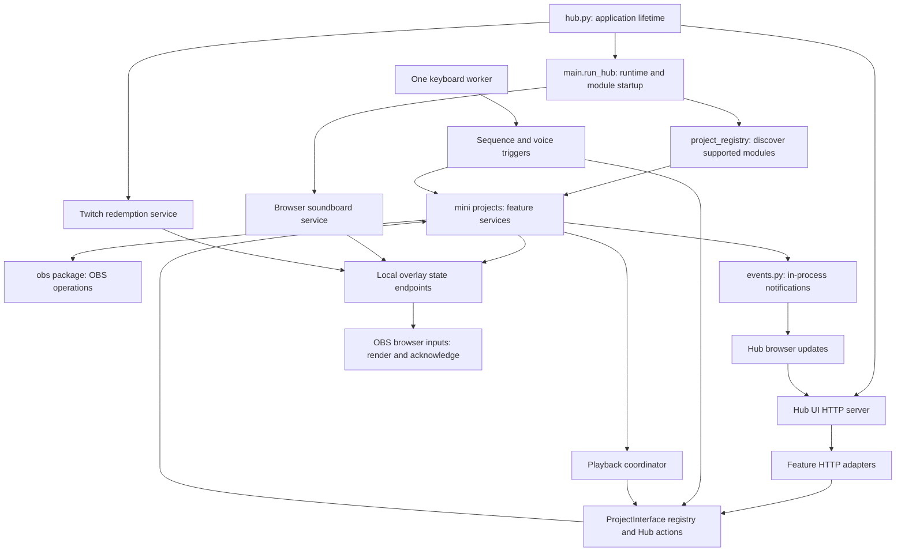

# Streaming Hub architecture

The supported application is the v2 checkout launched by `Run Hub.bat` / `hub.py`.
It is one Python process with module threads, local HTTP services and one keyboard
worker subprocess. OBS owns the stream and media sources. Closing or restarting
the Hub does not inherently stop OBS's stream.

## System map

Arrows show calls or data flow, not permission to import both directions. Feature
engines should not import HTTP handlers. Renderers should not decide whether a
Twitch redemption or League event happened. Modules should use interfaces or
events for cross-module work instead of importing another module's player.

## Ownership and navigation

| Responsibility | Owner | Contract |
| --- | --- | --- |
| Application lifetime | `hub.py` | Starts runtime, editor, Hub UI, monitoring and redemptions; shares shutdown event |
| Runtime setup and startup readiness | `main.py` | Loads environment, discovers selected modules, starts voice/modules, joins module threads |
| Module discovery on disk | `lib/project_registry.py` | Supported module allowlist and runtime/editor metadata; importing discovery does not launch module threads |
| Live project interfaces | `lib/project_runtime.py` | One process-wide registry, status/actions/pause/resume/revert; `shared.py` re-exports the same objects |
| Playback coordination | `coordinator.py`, `hub_rules.py` | Requests pauses before playback, resumes according to rules, tracks scene ownership |
| Domain notifications | `events.py` | Synchronous callbacks in the emitting thread; long work must be handed off |
| Keyboard input | `lib/global_hotkeys.py`, `lib/keyboard_worker.py` | One child captures keys; subscribers receive events without installing their own native hooks |
| Voice capture | `voice/`, `shared.VoicePTT` | Shared capture/transcription and trigger-window lifecycle |
| Reusable media playback | `lib/shared_media/` | Profiles, phrase matching, worker/player behavior and placement |
| OBS integration | `obs/` | Connection and source/media/scene operations |
| Settings transactions/history | `lib/project_settings.py`, `lib/settings_backups.py` | Serialized audio edits and external versioned recovery history |

`lib/project_registry.py` and `lib/project_runtime.py` deliberately have different
jobs: the former finds modules, the latter exposes the instances already running.
Do not introduce a second runtime registry, event bus or keyboard listener.

## Hub UI boundaries

`hub_ui/server.py` is the HTTP entry point and lifecycle owner. It composes explicit
route mixins; each owns a disjoint set of handlers and uses `_body`, `_json` and
`_err` from the common handler. Existing URLs and JSON response shapes stay stable.
The mixins do not start services or import the server back.

| File | Owns |
| --- | --- |
| `server.py` | HTTP routing, response/body helpers, SPA files, socket and worker lifetime |
| `routes/controls.py` | Status, settings, coordination rules, actions and workflows |
| `routes/audio.py` | Audio/mixer request validation and responses |
| `routes/profiles.py` | Shared editor profile/config endpoints |
| `routes/projects.py` | Existing project-specific music, replay, scene and SFX endpoints |
| `audio.py` | Loaded-asset identification, volume calculation, OBS/disk reconciliation and Love Me's audio adapter |
| `settings.py` | Hub settings persistence/defaults and coordination-rule configuration |
| `commands.py` | Common action/workflow dispatch plus browser notifications |
| `hotkeys.py` | Configured Hub action/workflow sequences through the shared keyboard bus |
| `project_status.py` | Read-only UI view of live project interfaces |
| `updates.py` | Bounded SSE queues, domain-event forwarding and periodic audio/status polling |
| `replay_media.py`, `replay_trim.py` | Replay preview and background trim jobs |
| `app/` | Browser navigation, pages and controls |

Dependencies go from routes to feature helpers, then to project interfaces, settings
or OBS. Helpers never import `server.py`. `commands.py` calls `hub_actions.py` for
the action itself and `updates.py` for its UI notification. `updates.py` adapts the
existing event bus; it is not a second domain event bus.

Some older project endpoints still read an interface module's `_live` dictionary.
That compatibility access is concentrated in `routes/projects.py`. New generic
actions should use `ProjectInterface.run_action()` through `hub_actions.py`.
Module-specific settings/HTTP services can remain separate when they own a distinct
feature, as League and Twitch do. Avoid moving their detection into the Hub UI.

## Important flows

### Soundboard and audio ownership

1. The configured soundboard sequence opens its capture/selection window.
2. Ctrl+6 selects the muffin sound only within that window. The browser effect
   channel owns its current asset; the renderer follows the audio playback clock.
3. Playback requests use the existing coordinator and module/player interface.
4. For a shared OBS media input, the loaded file identifies which asset owns the
   fader. For a browser input, its effect channel identifies the current asset.
5. `hub_ui/audio.py` reconciles manual OBS edits into that asset's offset. The
   mixer route, poller and other audio editors share the settings transaction lock.
   An explicit project/profile slider edit is the path for a broader change.

Do not infer asset identity from a stale UI selection. Project gain, profile gain,
category gain and per-file offset contribute to the effective level. The small
post-write suppression window prevents the poller from reading its own incomplete
disk/OBS update as a new manual fader edit.

### League

`lib/league_live_client.py` supplies a short cached snapshot with separate copies
for consumers. `league` owns established audio, game/session behavior and recording;
`league_api` owns configurable detection and browser presentation. It separates:

- `engine.py`: snapshot/event detection and existing clip scheduling.
- `production/director.py`: border priorities, cooldowns, ambient state and endings.
- `production/catalog.py`: declarative effect definitions and controls.
- `production/objectives.py`: conservative objective timing inference.
- `main.py`: locks, polling, service state and persistence orchestration.
- `http_server.py`: browser transport.
- `production/web/`: rendering only; visual modules are grouped by effect family.

Historical event baselines prevent reconnects from replaying old kills. Uncertain
signals stay labeled and optional. See the [production guide](../mini%20projects/league_api/production/README.md).

### Twitch and browser overlays

Twitch EventSub delivery goes to the relevant service, then its engine validates,
deduplicates and schedules an effect. The OBS browser consumes bounded state and
reports readiness/completion where the service requires it. A control-page preview
and an on-air effect are different operations; check the feature's contract.

| Port | Service | Feature ownership |
| --- | --- | --- |
| 7420 | Hub UI | Controls and status; no effect renderer |
| 7431 | League API | Game detection, clip alerts and production borders |
| 7442 | Twitch redemptions | Channel Points delivery, effect configuration and fulfillment |
| 7443 | Twitch celebrations | Raids, follows, subscriptions, gifts and cheers |
| 7444 | Browser soundboard | Audio-synchronized soundboard border playback |
| 8765 | Shared hotkey editor | Profiles, assets, phrases and layout controls; may choose a free port |

These services intentionally retain their own engines and authorization boundaries.
Do not combine Twitch credential storage with overlay rendering. Read the existing
[redemption](../lib/twitch_redemptions/README.md),
[celebration](../mini%20projects/twitch_celebrations/README.md), and
[browser audio](../lib/browser_effects/README.md) contracts before extending them.

## Lifetime and concurrency

Imports define code; explicit startup functions own threads and listeners. Modules
signal readiness through `startup_event` and observe the shared `stop_event`.
The UI binds its socket before starting workers. Its local stop event, socket,
hotkey subscription and domain-event forwarding are cleaned up together, including
partial startup failure. SSE queues are bounded so a slow browser cannot block
domain-event producers; disconnect/shutdown releases each queue.

Registry locks protect registry data and are released before calling module code.
Engine/service locks protect feature state. The audio transaction lock protects
the disk/OBS handoff. Avoid holding a registry lock while calling a player, making
network requests or waiting for another thread.

## Persistent data and extension rules

Module JSON, profiles, phrases, media paths, transforms, OBS filters and volume
offsets are personalized data. Keep their paths and schemas stable during code
extraction. Credentials remain in ignored `.env`/Twitch files or external service
storage. Settings history is outside the repository under
`LOCALAPPDATA/StreamingHub/settings-history` and is not cleanup material.
Recordings and replays currently use `C:\StreamingMedia\Replays`; follow
[RECORDING-STORAGE.md](../RECORDING-STORAGE.md) before changing those paths.

For a new action, add the behavior to its owning module/interface and expose it
through the common action path. For an effect, add a catalog definition and a
renderer in the relevant feature; keep network detection in the engine/service.
For a new Hub endpoint, use the matching route module and a helper when business
logic can be called independently of HTTP. Add a new process/service only when its
lifetime or external integration requires one.

## Validation

`tools/test_hub_architecture.py` exercises real local HTTP routing, isolated import,
bounded event forwarding, command dispatch, disabled hotkeys, bind failure and
server cleanup. Audio, startup, profile, ownership and browser-effect regression
tests cover the shared boundaries. All tests use temporary settings or mocked
external operations; never use a live stream as the synthetic-event test fixture.

The architecture checkpoint before this refactor is Git commit `4821e9c`.

Validation on 2026-09-29 covered 107 targeted regression/lifecycle cases, including
real HTTP and SSE responses, partial startup failure and disconnect cleanup. The
supported Hub was subsequently reopened with these files and one keyboard child.
All ten modules were registered; settings, profiles and mixer endpoints returned
200. Headless Chrome loaded the Hub and received its status event stream. League,
Twitch celebrations and Channel Points reported healthy overlay connections.
OBS was open and not streaming during final verification; no synthetic stream
effects or desktop input were used. Replay configuration remained on C:.
